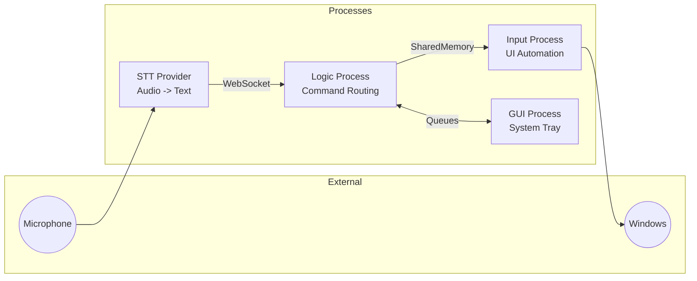

# Wheelhouse Architecture

> A summary of system structure, process boundaries, and how the processes
> talk to each other. Deeper design documents live in `docs/design/`.

## Process architecture

Wheelhouse runs as several cooperating OS processes. A supervisor spawns
three application processes and restarts them after a crash; the selected
speech provider runs as its own process on top.

```
Launcher (supervisor, launcher.py)
    |
    +-- Logic Process (services/wheelhouse/main.py)   command routing
    +-- Input Process (input_proc.py)                 Windows input injection
    +-- GUI Process (gui.py)                          system tray, notices

STT (configured via config.toml stt.mode; "remote" is the default and
the supported mode -- the installer sets up remote providers only):
    Remote mode:  RemoteSTTLauncher starts a provider process from
                  services/stt_providers/<provider>/ (each has its own uv venv)
    In-process:   STTManager inside the logic process. Development mode:
                  its extra speech packages are not installed by the
                  installer, and without them speech recognition stays off
```

The separation is deliberate: a crash in speech recognition, input
injection, or the GUI cannot take down the others, and the supervisor
restarts what died. Do not share Python objects across these boundaries —
each connection below has a defined transport and schema.

## High-level flow



## Inter-process channels

| Connection | Transport | Format | Purpose |
|------------|-----------|--------|---------|
| STT -> Logic | WebSocket | JSON | Streaming transcripts |
| Logic -> Input | SharedMemory (64 KB) | Pickle | UI commands |
| Input -> Logic | Response queue | Pickle | Command results |
| Logic <-> GUI | Queues | JSON | State sync, commands |

## Logic process

`LogicController` (main.py) owns:

- **ServiceManager** — long-lived services: display dimming and brightness
  coordination, TV control, audio monitoring (speech suppression while
  other audio plays), voice-controlled mouse, the keyboard filter used
  during dictation, the speech pipeline container, the AI client, and the
  STT launcher or in-process manager.
- **StateManager** — state synchronization with the GUI.
- **EventBus** — publish/subscribe used by services and plugins.
- **PluginRegistry** — auto-discovers plugins (Sonos speakers, Sony TVs,
  window positioning, system volume, idle detection, internal display).
- **WebSocketManager** — receives streaming transcripts from the provider.
- **Speech pipeline** — `SpeechHandler -> SpeechProcessor -> SpeechRouter ->
  TextParser -> actions`, driven by a shared `PatternCatalog` of voice
  command patterns.

## Speech pipeline

```
Audio -> STT provider -> WebSocket -> WordEvent
                                         |
                                         v
                                 SpeechProcessor
                                 (truth-table state machine)
                                         |
                         +---------------+---------------+
                         |               |               |
                     COMMAND         DICTATION      REPLACEMENT
                         |               |               |
                         v               v               v
                     TextParser    focus-redirect    TextParser
                         |          check first          |
                         +---------------+---------------+
                                         |
                                         v
                              Input Process (UIActionHandler)
                                         |
                                         v
                           InsertionRouter + strategy
                                         |
                                         v
                          Windows SendInput / clipboard
```

Words arrive one at a time and are routed by a state machine: command
words execute patterns, dictation flows to the focused application, and
replacement words (spoken punctuation like "comma") become their symbols.
When the focused window is a terminal at a shell prompt, dictation is
redirected into Wheelhouse's own dictation editor; pressing Enter there
sends the finished text to the terminal.

## Input process

The input process receives commands over shared memory and executes them
against Windows:

- **UIActionHandler** — the command executor.
- **Text-target check** — before any keystroke or clipboard write, a check
  decides whether the focused control accepts dictated text (real text
  controls pass; approved controls paste silently; unproven editors get a
  rejection notice with a Try-it-anyway button; controls with no useful
  identity are rejected silently).
- **InsertionRouter** — picks a text-insertion strategy per target:
  Unicode SendInput for short text in normal applications, a
  clipboard-based strategy for long text, variants for Flutter apps and
  approved-paste targets.
- **Clipboard operations** — save/restore around clipboard-based
  insertion, selection transforms, per-utterance accumulation.
- **Voice element clicking** — walks the focused window's UI Automation
  tree to find and click controls by name, plus a numbered overlay
  ("apply numbers" / "click 5") painted by the GUI process.

## Key entry points

| Process | Entry point | Role |
|---------|-------------|------|
| Launcher | `services/wheelhouse/launcher.py` | Spawns processes, crash recovery |
| Logic | `services/wheelhouse/main.py` | Command routing, EventBus, plugins |
| Input | `services/wheelhouse/input_proc.py` | SendInput, clipboard, UI Automation |
| GUI | `services/wheelhouse/gui.py` | System tray, notifications, overlays |
| STT providers | `services/stt_providers/<provider>/` | One process per provider, own uv venv |

## Configuration

| File | Purpose |
|------|---------|
| `services/wheelhouse/config.toml` | Runtime settings (copy `config.toml.example`; per-machine, untracked) |
| `services/wheelhouse/speech/config/patterns.toml` | Shipped voice-command patterns (read-only) |
| `services/wheelhouse/data/user_patterns.toml` | Personal voice patterns (written by the Pattern Manager; merged over the shipped file at load) |
| `services/stt_providers/<provider>/config.toml` | Per-provider settings |
| `%LOCALAPPDATA%\WheelHouse\stt_model_overrides.toml` | Per-machine model paths (written by the installer) |

## Further reading

- `docs/design/stt-and-ai.md` — the three STT providers, model delivery
  and the override mechanism, thin-client AI.
- `docs/design/speech-pipeline-analysis.md` — the streaming transcript
  pipeline: stability detection, holdback, finalization.
- `docs/design/text-insertion-pipeline.md` — insertion strategies,
  clipboard operations, and their trade-offs.
- `PRIVACY.md` — data flow, logging defaults, and the local capability
  disclosure.
