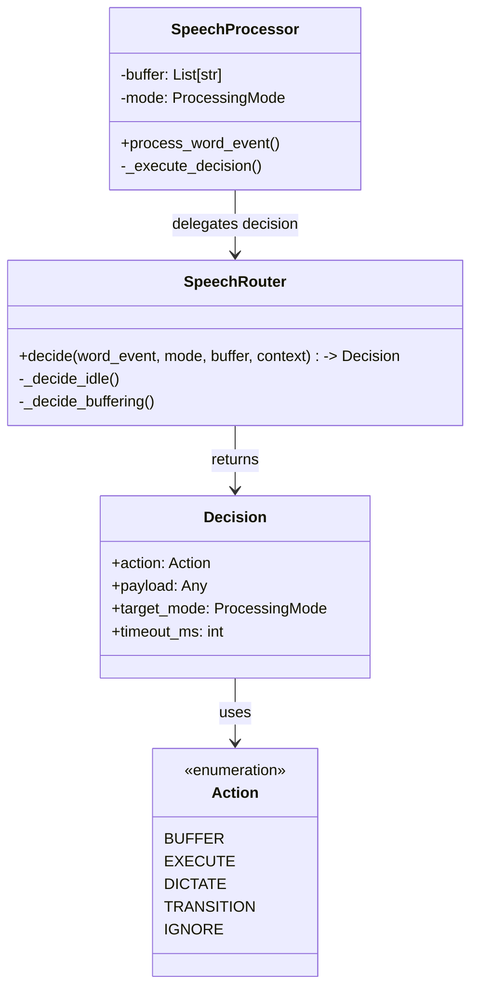
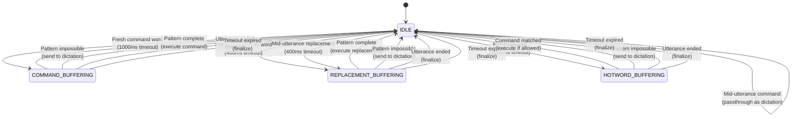

# Speech Processor Guide

**Purpose**: Help developers understand the speech processor's decision logic through visual diagrams and concrete examples.

**Audience**: Contributors who need to understand or modify speech processing behavior.

---

## Overview

The speech processor solves a hard real-time problem: **distinguishing commands from dictation**.

**Example Challenge**:
- "delete line" → Execute command (delete a line)
- "I want to delete line" → Type as text (user is dictating about deletion)

Both contain the words "delete line", but intent is completely different. The processor decides based on **utterance position** and **pattern type**.

**Architecture Update (Phase 3)**:
The decision logic has been extracted into a dedicated `SpeechRouter` class (`router.py`), separating pure decision logic from side effects (execution, buffering, timeouts).

---

## Architecture



---

## State Machine Diagram



---

## Truth Table (IDLE Mode Decisions)

### Fresh Utterance (start_of_utterance=True)

| Word Example | In Catalog? | Pattern Type | Action | Mode Transition |
|:-------------|:------------|:-------------|:-------|:----------------|
| "hello" | No | NONE | Passthrough (0ms) | Stay IDLE |
| "delete" | Yes | COMMAND | Buffer | → COMMAND_BUFFERING |
| "mary" | Yes | REPLACEMENT | Buffer | → REPLACEMENT_BUFFERING |
| "x-ray" | N/A | N/A (hotword) | Buffer | → HOTWORD_BUFFERING |

### Mid-Utterance (start_of_utterance=False)

| Word Example | In Catalog? | Pattern Type | Action | Mode Transition |
|:-------------|:------------|:-------------|:-------|:----------------|
| "world" | No | NONE | Passthrough (0ms) | Stay IDLE |
| "delete" | Yes | COMMAND | Passthrough (0ms) | Stay IDLE |
| "mary" | Yes | REPLACEMENT | Buffer | → REPLACEMENT_BUFFERING |

**Key Insight**: Commands mid-utterance are treated as dictation, but replacements still buffer (because "mary smith" mid-sentence is still a name replacement).

---

## Example Traces

### Example 1: Command Execution ("delete line")

```
Input: "delete line"

┌─────────────────────────────────────────────────────────────┐
│ Word 1: "delete"                                            │
├─────────────────────────────────────────────────────────────┤
│ • start_of_utterance: True                                  │
│ • In catalog: Yes                                           │
│ • Pattern type: COMMAND                                     │
│ Router Decision: BUFFER (Fresh command buffering)           │
│   → Target Mode: COMMAND_BUFFERING                          │
│   → Timeout: 1000ms                                         │
│ Processor Action: Start buffering, set timeout              │
└─────────────────────────────────────────────────────────────┘

┌─────────────────────────────────────────────────────────────┐
│ Word 2: "line" (arrives 200ms later)                        │
├─────────────────────────────────────────────────────────────┤
│ • Mode: COMMAND_BUFFERING                                   │
│ • Buffer + word: "delete line"                              │
│ Router Check: Is pattern complete?                          │
│   → Pattern "delete line$" matches exactly ✓                │
│ Router Decision: EXECUTE (Pattern complete)                 │
│ Processor Action: Execute delete_line command               │
│ Return to IDLE                                              │
│ Result: Line deleted ✓                                      │
└─────────────────────────────────────────────────────────────┘

Total time: ~200ms (no timeout wait needed)
```

---

### Example 2: Dictation ("I want to delete line")

```
Input: "I want to delete line"

┌─────────────────────────────────────────────────────────────┐
│ Word 1: "I"                                                 │
├─────────────────────────────────────────────────────────────┤
│ • start_of_utterance: True                                  │
│ • In catalog: No                                            │
│ • Pattern type: NONE                                        │
│ Router Decision: DICTATE (Passthrough)                      │
│ Processor Action: Send "I" to dictation                     │
│ Stay in IDLE                                                │
└─────────────────────────────────────────────────────────────┘

┌─────────────────────────────────────────────────────────────┐
│ Word 2: "want"                                              │
├─────────────────────────────────────────────────────────────┤
│ • start_of_utterance: False (mid-utterance)                 │
│ • In catalog: No                                            │
│ • Pattern type: NONE                                        │
│ Router Decision: DICTATE (Passthrough)                      │
│ Processor Action: Send "want" to dictation                  │
│ Stay in IDLE                                                │
└─────────────────────────────────────────────────────────────┘

┌─────────────────────────────────────────────────────────────┐
│ Word 3: "to"                                                │
├─────────────────────────────────────────────────────────────┤
│ Router Decision: DICTATE                                    │
│ Processor Action: Send "to" to dictation                    │
└─────────────────────────────────────────────────────────────┘

┌─────────────────────────────────────────────────────────────┐
│ Word 4: "delete"                                            │
├─────────────────────────────────────────────────────────────┤
│ • start_of_utterance: False (mid-utterance)                 │
│ • In catalog: Yes                                           │
│ • Pattern type: COMMAND                                     │
│ Router Decision: DICTATE (Mid-utterance command passthrough)│
│   → Commands mid-utterance are dictation text!              │
│ Processor Action: Send "delete" to dictation                │
│ Stay in IDLE                                                │
└─────────────────────────────────────────────────────────────┘

┌─────────────────────────────────────────────────────────────┐
│ Word 5: "line"                                              │
├─────────────────────────────────────────────────────────────┤
│ Router Decision: DICTATE                                    │
│ Processor Action: Send "line" to dictation                  │
│ Result: Text typed, NO command executed ✓                   │
└─────────────────────────────────────────────────────────────┘

Total time: ~0ms per word (all passthrough, no buffering)
```

**Critical Difference**: "delete" at utterance START → command. "delete" mid-utterance → dictation.

---

### Example 3: Replacement Pattern ("my name is mary smith")

```
Input: "my name is mary smith"

┌─────────────────────────────────────────────────────────────┐
│ Words 1-3: "my name is"                                     │
├─────────────────────────────────────────────────────────────┤
│ Router Decision: DICTATE (Passthrough)                      │
│ Processor Action: Send words to dictation                   │
└─────────────────────────────────────────────────────────────┘

┌─────────────────────────────────────────────────────────────┐
│ Word 4: "mary"                                              │
├─────────────────────────────────────────────────────────────┤
│ • start_of_utterance: False (mid-utterance)                 │
│ • In catalog: Yes                                           │
│ • Pattern type: REPLACEMENT                                 │
│ Router Decision: BUFFER (Mid-utterance replacement buffering)│
│   → Replacements buffer even mid-utterance!                 │
│   → Target Mode: REPLACEMENT_BUFFERING                      │
│   → Timeout: 400ms                                          │
│ Processor Action: Start buffering                           │
└─────────────────────────────────────────────────────────────┘

┌─────────────────────────────────────────────────────────────┐
│ Word 5: "smith" (arrives 150ms later)                       │
├─────────────────────────────────────────────────────────────┤
│ • Mode: REPLACEMENT_BUFFERING                               │
│ • Buffer + word: "mary smith"                               │
│ Router Check: Is pattern complete?                          │
│   → Pattern "mary smith$" matches exactly ✓                 │
│ Router Decision: EXECUTE (Pattern complete)                 │
│ Processor Action: Execute replacement (TextParser)          │
│ Return to IDLE                                              │
│ Result: Name properly capitalized ✓                         │
└─────────────────────────────────────────────────────────────┘

Total time: ~150ms (pattern completed before 400ms timeout)
```

**Why buffer replacements mid-utterance?** Because "mary smith" is a name that needs proper capitalization, regardless of where it appears in the sentence.

---

### Example 4: Hotword Safety ("x-ray close window")

```
Input: "x-ray close window"
Context: "close window" has requires_hotword=True

┌─────────────────────────────────────────────────────────────┐
│ Word 1: "x-ray"                                             │
├─────────────────────────────────────────────────────────────┤
│ • start_of_utterance: True                                  │
│ • Word matches hotword: Yes                                 │
│ Router Decision: TRANSITION (Fresh hotword detected)        │
│   → Target Mode: HOTWORD_BUFFERING                          │
│   → Timeout: 1000ms                                         │
│ Processor Action: Enter HOTWORD_BUFFERING, set hotword flag │
└─────────────────────────────────────────────────────────────┘

┌─────────────────────────────────────────────────────────────┐
│ Word 2: "close"                                             │
├─────────────────────────────────────────────────────────────┤
│ • Mode: HOTWORD_BUFFERING                                   │
│ Router Decision: BUFFER (Continue buffering)                │
│ Processor Action: Add "close" to buffer                     │
└─────────────────────────────────────────────────────────────┘

┌─────────────────────────────────────────────────────────────┐
│ Word 3: "window"                                            │
├─────────────────────────────────────────────────────────────┤
│ • Mode: HOTWORD_BUFFERING                                   │
│ • Buffer: ["close", "window"]                               │
│ Router Check: Is pattern complete? Yes                      │
│   → "close window" matches command pattern                  │
│   → requires_hotword: True                                  │
│   → hotword_active: True ✓                                  │
│ Router Decision: EXECUTE (Pattern complete)                 │
│ Processor Action: Execute command (hotword unlocks it)      │
│ Result: Window closes ✓                                     │
└─────────────────────────────────────────────────────────────┘

Total time: ~300ms (pattern completed early)
```

**Without hotword**: Saying "close window" alone → treated as dictation (safety feature prevents accidental window closing).

---

### Example 5: Timeout Scenario ("delete" alone, then pause)

```
Input: "delete" [long pause, no more words]

┌─────────────────────────────────────────────────────────────┐
│ Word 1: "delete"                                            │
├─────────────────────────────────────────────────────────────┤
│ • start_of_utterance: True                                  │
│ • In catalog: Yes                                           │
│ • Pattern type: COMMAND                                     │
│ Router Decision: BUFFER (Fresh command buffering)           │
│ Processor Action: Start buffering, set 1000ms timeout       │
└─────────────────────────────────────────────────────────────┘

┌─────────────────────────────────────────────────────────────┐
│ [No more words arrive]                                      │
│ [1000ms elapses]                                            │
├─────────────────────────────────────────────────────────────┤
│ Timeout Handler Triggered                                   │
│ Processor calls: router.decide_timeout(buffer)              │
│ Router Logic:                                               │
│   → "delete$" matches as single-word command ✓              │
│ Router Decision: EXECUTE (Finalized as command)             │
│ Processor Action: Execute delete (deletes 1 character)      │
│ Return to IDLE                                              │
│ Result: Single character deleted ✓                          │
└─────────────────────────────────────────────────────────────┘

Total time: 1000ms (waited full timeout)
```

**Timeout purpose**: Allows user to add optional parameters ("delete three", "delete word"), but executes minimal command if user stops talking.

---

## Decision Tree Flowchart

```
WordEvent arrives
    ↓
Is mode IDLE?
    ↓ Yes
    ├─ Is word hotword AND fresh? → TRANSITION (HOTWORD_BUFFERING)
    ├─ Is word NOT in catalog? → DICTATE
    ├─ Is word COMMAND type?
    │   ├─ Fresh? → BUFFER (COMMAND_BUFFERING)
    │   └─ Mid-utterance? → DICTATE
    └─ Is word REPLACEMENT type?
        ├─ Fresh OR mid? → BUFFER (REPLACEMENT_BUFFERING)

    ↓ No (in buffering mode)
    ├─ Add word to buffer
    ├─ Is pattern complete? → EXECUTE
    ├─ Is pattern impossible? → Finalize (EXECUTE/DICTATE)
    ├─ Is utterance ended? → Finalize (EXECUTE/DICTATE)
    └─ Still possible? → BUFFER (Continue)
```

---

## Key Design Patterns

### 1. **Utterance Position Matters**

- **Fresh words** (start_of_utterance=True): Might be commands
- **Mid-utterance words**: Usually dictation (except replacements)

This is why "delete line" executes but "I want to delete line" doesn't.

### 2. **Pattern Type Discrimination**

- **COMMAND**: Fresh → buffer, mid-utterance → passthrough
- **REPLACEMENT**: Fresh OR mid → buffer (names need capitalization anywhere)
- **NONE**: Always passthrough

### 3. **Buffering with Timeouts**

- **1000ms** for commands (allows optional params: "delete three words")
- **400ms** for replacements (faster, no optional params)
- **Early completion**: If pattern completes before timeout, execute immediately

### 4. **Hotword Safety Gate**

- Some commands require "x-ray" prefix to prevent accidents
- Hotword unlocks requires_hotword commands
- Without hotword, command → dictation

---

## Performance Characteristics

**Typical word distribution**:
- 95%+ words: Passthrough (0ms latency)
- 3-4% words: Buffering (400-1000ms latency)
- <1% words: Hotword scenarios

**Why most words passthrough**:
- Mid-sentence words are rarely commands
- Only first word of utterance could be command
- Non-catalog words always passthrough

**Latency**:
- Passthrough: 0ms (immediate)
- Pattern completion: ~200-300ms (typical)
- Timeout: 400ms (replacements) or 1000ms (commands) worst case

---

## Common Gotchas

### "Why does 'delete' sometimes execute and sometimes type?"

**Context matters**:
- Start of utterance: "delete" → Executes
- Mid-utterance: "...to delete..." → Types as text

### "Why do replacements buffer mid-utterance but commands don't?"

**Different use cases**:
- Commands are intentional actions (deliberate, at utterance start)
- Replacements are name corrections (happen anywhere in sentence)

### "What if I want to type the word 'delete' at document start?"

**Use hotword gating**:
- Make "delete" require hotword: requires_hotword=True
- Then: "delete" → Types as text
- And: "x-ray delete" → Executes command

---

## Testing the Decision Logic

See `tests/speech/test_comprehensive_patterns.py` for extensive test coverage of all decision paths.

**Key test scenarios**:
- Fresh vs mid-utterance positioning
- Command vs replacement type handling
- Hotword gating
- Timeout behaviors
- Pattern completion detection

---

## Further Reading

- **Implementation**: `services/wheelhouse/speech/speech_processor.py`
- **Router Logic**: `services/wheelhouse/speech/router.py`
- **Domain Objects**: `services/wheelhouse/speech/domain.py`
- **Pattern Catalog**: `services/wheelhouse/speech/pattern_catalog.py`
- **Tests**: `tests/speech/test_comprehensive_patterns.py`
- **Configuration**: `services/wheelhouse/speech/config/patterns.toml`
